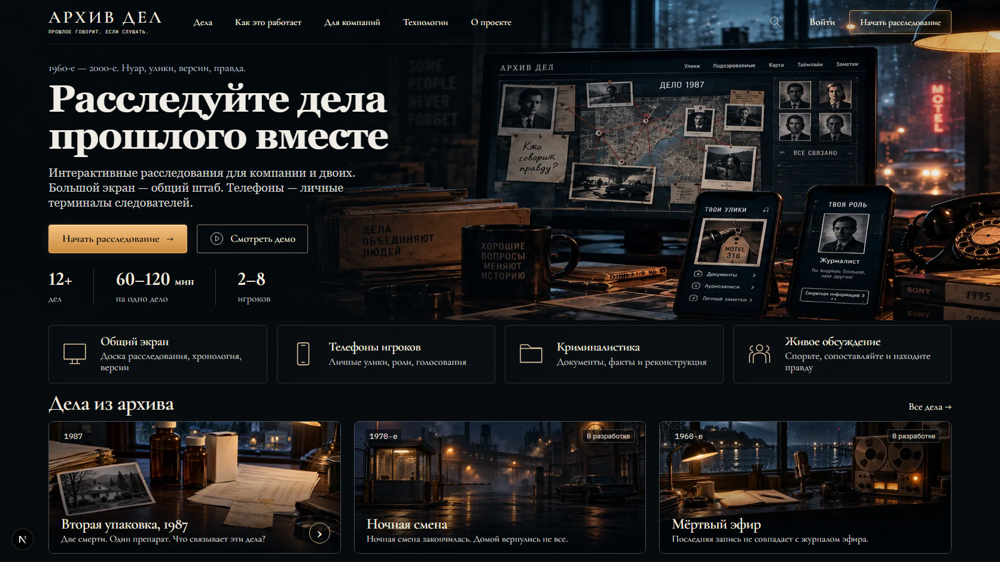

# Evgeny Ponomarev

### Full-stack developer building web products

I work across product interfaces, server-side logic and deployment. My current focus is **Telyra**, a live booking SaaS, and **Archive of Cases**, a cooperative investigation platform in development.

[Telyra — live product](https://telyra.ru) · [Email](mailto:ponomareve45@gmail.com) · [Русский](https://github.com/EvgenyPonomarevNova/EvgenyPonomarevNova/blob/main/README.ru.md)

**[Browse all projects →](https://github.com/EvgenyPonomarevNova/EvgenyPonomarevNova/blob/main/PROJECTS.md)** — products, applications, client websites and frontend experiments.

## Products

<table>
<tr>
<td width="50%" valign="top">

<h3><a href="https://github.com/EvgenyPonomarevNova/telyra">Telyra</a></h3>

<strong>Live product</strong> · Booking pages, working schedules, appointments and client records for independent service professionals.

Next.js · React · TypeScript · Payload · PostgreSQL

<a href="https://telyra.ru">Open product</a> · <a href="https://github.com/EvgenyPonomarevNova/telyra">Project & architecture</a>

</td>
<td width="50%" valign="top">

<h3><a href="https://github.com/EvgenyPonomarevNova/archive-of-cases">Archive of Cases · Архив дел</a></h3>

<strong>In development</strong> · Shared-screen investigations with private phone evidence, real-time sessions and recoverable game state.

Next.js · TypeScript · Socket.IO · PostgreSQL · Three.js

<a href="https://github.com/EvgenyPonomarevNova/archive-of-cases">Screenshots & architecture</a>

</td>
</tr>
</table>

The product repositories are public showcases; their application source remains private. Archive of Cases currently has one implemented case. Its screenshots include earlier development states and planned catalogue figures.

## Engineering interests

- Product UI that connects to real application state.
- Authentication, permissions and tenant-scoped business data.
- Real-time collaboration, reconnect handling and persistent sessions.
- Purposeful motion and 3D where they help the experience.

**Daily tools:** TypeScript, React, Next.js, Node.js, PostgreSQL, Docker, Git.

## Open-source work

- **[FrameDock](https://github.com/EvgenyPonomarevNova/FrameDock)** — Windows graphics-mod manager with a clearer setup and recovery workflow. Preview release; independent development of 1-Click-DLSS5 with upstream attribution.
- **[React Bits — PR #1084](https://github.com/DavidHDev/react-bits/pull/1084)** — fixes invalid ref initialization in the JavaScript/Tailwind GlassSurface component and its CLI registry copy. Submitted for review.

## Selected applications & client websites

| Project | Work |
| --- | --- |
| [NexusHub](https://github.com/EvgenyPonomarevNova/freelance-frontend) | Freelance platform prototype: projects, profiles, authentication and chat interfaces. |
| [ТехноИмпериум](https://github.com/EvgenyPonomarevNova/Shield-Automation) | Multi-page corporate frontend with catalogue, search and gallery modules. |
| [M1 / Invest](https://github.com/EvgenyPonomarevNova/invest) | Five-page corporate website. |
| [Growth Laboratory](https://github.com/EvgenyPonomarevNova/landing-page-growth-laboratory-v2) | Freelance landing page with two available iterations. |
| [1win](https://github.com/EvgenyPonomarevNova/1win-landing-page) | Freelance landing page with HTML/CSS and SCSS implementations. |

[All websites, portfolios and experiments →](https://github.com/EvgenyPonomarevNova/EvgenyPonomarevNova/blob/main/PROJECTS.md)

## Contact

For product development and collaboration: **[ponomareve45@gmail.com](mailto:ponomareve45@gmail.com)**.
